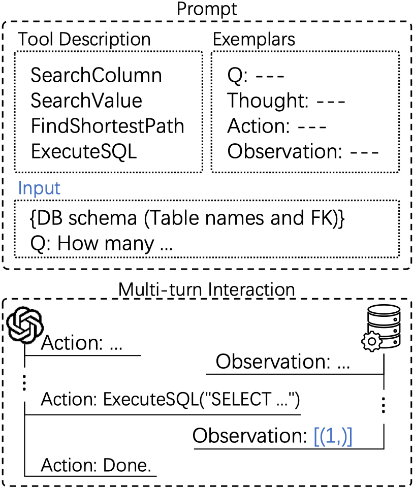

# Interactive-Text-to-SQL

This repository contains the official implementation of the CIKM 2025 paper **"Multi-Turn Interactions for Text-to-SQL with Large Language Models"**.

<div align="center">

[](https://dl.acm.org/doi/10.1145/3746252.3761052)
[](https://arxiv.org/abs/2408.11062)

</div>

The following figure illustrates the overall workflow.

<div align="center">
  
</div>


## Download datasets


Download the raw datasets from their original sources, and organize them under `dataset/` with the following structure:

```
dataset
├── spider (about 1018MB)
│   └── database (ln -s ./test_database ./database)
│       ├── aan_1
│       └── ...
├── Spider-DK
│   └── database
│       ├── new_concert_singer
│       └── ...
├── Spider-Realistic
│   ├── dev.json
│   └── ... 
├── Spider-Syn
│   ├── dev.json
│   └── ...
├── bird (about 45G)
│   ├── column_meaning.json
│   └── dev_databases
│       ├── california_schools
│       └── ...
├── bird-FinC
│   ├── financial_corrected.json
│   └── ...
├── bird-minidev
│   └── dev_databases
│       ├── california_schools
│       └── ...
└── spider2-sqlite
    └── spider2-localdb
        ├── AdventureWorks.sqlite
        └── ...
```


## Preprocess

We provide preprocessed artifacts as tarballs under `targz/` (optional).

For database preprocessing, you can either use the provided artifacts or run the scripts yourself.

To use the provided artifacts:

```bash
tar -xzf targz/cols_info.tar.gz
tar -xzf targz/dbs_info.tar.gz
```

This will produce `database/cols_info/` and `database/dbs_info/`.

Alternatively, you can run `preprocess/{db}_step1_cols_info.py` and `preprocess/{db}_step2_dbs_info.py` to process them yourself.


## Tool Setup

Tested environment:
```
OS: Ubuntu 22.04.2 LTS
CPU: Intel(R) Xeon(R) Silver 4210R CPU @ 2.40GHz
Memory: 128 GB
Python: 3.11.5
ElasticSearch: 8.14.1 (JDK 21.0.2)
ChromaDB: 0.5.4
```

Install dependencies:

```bash
pip install -r requirements.txt
```

### Start ElasticSearch

Please refer to `tool/client_es.py`.

### Indexing

You need to build the indices before running inference.

```bash
export OPENAI_API_KEY=xxx
export PYTHONPATH=$(pwd):$PYTHONPATH

# spider
python preprocess/spider_step3_indexing_es.py
python preprocess/spider_step4_vectorization.py

# bird
python preprocess/bird_step3_indexing_es.py
python preprocess/bird_step4_vectorization.py
```

## Start Interactive Inference

Run the following commands to verify that the tools are working correctly:

```bash
python tool/spider_search.py
python tool/spider_execution.py
```

Run `interactive_text_to_sql.py` to start an interactive session (see the script for available arguments).

e.g.
```bash
python interactive_text_to_sql.py --dataset "spider-dev" --model_name "gpt-4o-2024-05-13"
python interactive_text_to_sql.py --dataset "bird-dev" --model_name "gpt-4o-2024-05-13"
```

## Evaluation

We provide two ways to run evaluation:

### Option A (recommended): Evaluate our released final predictions

We release the final prediction files as `targz/result.tar.gz`. Extract it in the repo root (it contains a top-level `result/` directory):

```bash
tar -xzf targz/result.tar.gz
```

Make sure the datasets are downloaded and placed under `dataset/` as described above, then run the evaluation scripts:

```bash
# Spider (EM/EX + TS where applicable)
bash script/eval_all_spider.sh

# BIRD (ours)
bash script/eval_all_bird_no_evi.sh
bash script/eval_all_bird_with_evi.sh
```

### Option B: Generate `result/` from interaction logs, then evaluate

If you ran interactive inference yourself, you should have a directory like `save-crossdb-infer-dialog/...` that stores the full multi-turn interaction logs. You can convert those logs into the `result/` format expected by the evaluation scripts:

```bash
python make_final_res.py
```

We also release the full interaction logs as `targz/save-crossdb-infer-dialog-clean.tar.gz` (optional):

```bash
tar -xzf targz/save-crossdb-infer-dialog-clean.tar.gz
```

`make_final_res.py` expects the logs under `save-crossdb-infer-dialog/` by default. If you extract the released logs, rename the directory accordingly (or adjust the paths in `make_final_res.py`):

```bash
mv save-crossdb-infer-dialog-clean save-crossdb-infer-dialog
```

Note: `make_final_res.py` currently expects the model directory name `gpt-4o-2024-05-13` under each run folder. If your logs are saved under a different model name (e.g., `gpt-4o`), either rename that directory or update the paths in `make_final_res.py`.

After `result/` is generated, run the same scripts in `script/` as in Option A.

### Notes

- **Spider Test Suite (TS) evaluation**: `script/eval_all_spider.sh` uses
  - `evaluation/test_suite_sql_eval/testsuite_database`
  - `evaluation/test_suite_sql_eval/testsuite_tables.json`

  These are **not included** in this repo. Please obtain them from the official Test Suite repo and copy/symlink them into the paths above (the upstream repo is `https://github.com/taoyds/test-suite-sql-eval`). For example:

```bash
git clone https://github.com/taoyds/test-suite-sql-eval.git /tmp/test-suite-sql-eval
ln -s /tmp/test-suite-sql-eval/database evaluation/test_suite_sql_eval/testsuite_database
cp /tmp/test-suite-sql-eval/tables.json evaluation/test_suite_sql_eval/testsuite_tables.json
```

- **BIRD-FinC evaluation**: `make_final_res.py` expects the BIRD-FinC JSON files from `the-effects-of-noise-in-text-to-SQL` under the parent directory:

```bash
cd ..
git clone https://github.com/niklaswretblad/the-effects-of-noise-in-text-to-SQL.git
cd Interactive-Text-to-SQL-publish
```


